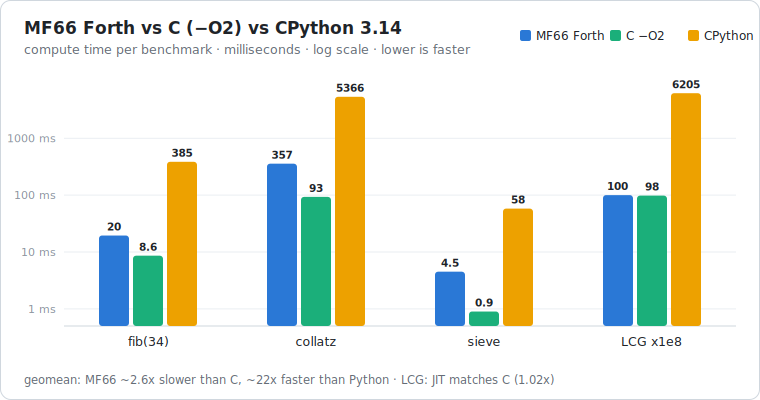

# MF66 benchmarks — Forth (JIT) vs C (`clang -O2`) vs Python (CPython 3.14)

Apple Silicon (arm64). Each program times **only its core computation** with a
monotonic, compute-only timer — Forth `utime`, C `clock_gettime(CLOCK_MONOTONIC)`,
Python `time.perf_counter()` — excluding process startup / JIT compile / interpreter
boot. Reported = **best of 5 serial runs** (min), run one at a time (no CPU
contention). All three implementations produce identical results, and the
cross-language ports passed an **adversarial fairness audit**: C loops verified
*not* constant-folded (`cc -O2 -S` shows real data-dependent loops / `bl` recursion),
Python is pure-stdlib (no numpy / C-extension / closed form), and the timed region
matches the Forth in every case.



| benchmark | MF66 Forth | C `-O2` | CPython 3.14 | MF66 vs C | MF66 vs Python |
|---|--:|--:|--:|--:|--:|
| `fib(34)` recursive       | 19.5 ms | 8.6 ms  | 385 ms  | 2.25× slower | **19.8× faster** |
| `collatz` Σ steps 1..10⁶  | 357 ms  | 93 ms   | 5366 ms | 3.83× slower | **15.0× faster** |
| `sieve` < 10⁶ (π = 78498) | 4.5 ms  | 0.9 ms\* | 58 ms   | 5.0× slower  | **12.8× faster** |
| `lcg` ×10⁸ (64-bit)       | 100 ms  | 98 ms   | 6205 ms | **1.02× (≈ C)** | **61.8× faster** |
| **geometric mean**        |         |         |         | **~2.6× slower than C** | **~22× faster than Python** |

\* C's prime-count pass auto-vectorizes (NEON) under `-O2`; with autovec defeated C
is ~2.1 ms, i.e. MF66 ~2.2× slower. The source has no SIMD/bitset tricks — this is
legitimate optimizing-compiler quality, which is exactly what a C head-to-head measures.

## Tail-call showcase

`tlcg` is the same 10⁸-iteration LCG **expressed as tail recursion** (`RECURSE`),
recursing 100,000,000 deep:

| | time | vs MF66 loop | vs C loop | vs Python loop |
|---|--:|--:|--:|--:|
| MF66 `tlcg` (tail recursion) | 149 ms | **1.49×** | 1.52× | **41.5× faster** |

The new terminal tail-call runs 10⁸-deep recursion in **O(1) return-stack space** at
~1.5× the cost of a `DO`/`LOOP`, and produces the bit-identical result
(`6299863613973285121`). Without it, this overflows the 64K-cell return stack.

## Takeaways

- On tight 64-bit integer arithmetic (`lcg`) the MF66 JIT is **at C speed** (1.02×) —
  the multiply/add loop compiles to a tight AArch64 inner loop.
- Across the suite MF66 is **~2.6× slower than optimized C** and **~22× faster than
  CPython** — strong for a small subroutine-threaded Forth JIT with no LLVM and a
  simple register pool.
- The optimizer earns its keep: strength reduction, the identity table, and the
  tail-call all land in real code paths here.

## Reproduce

```sh
# Forth (release engine)
target/release/mf66 bench/<name>.f < /dev/null      # name ∈ fib collatz sieve lcg tlcg

# C
cc -O2 -o /tmp/<name>_c bench/<name>.c && /tmp/<name>_c

# Python
python3 bench/<name>.py
```

Each prints `RESULT <value>` and `MICROS <compute-microseconds>`.
